# Introduction à la microéconomie

[TOC] /!\

## 1. Introduction

### Informations pratiques

Voir les slides d'introduction du cour ainsi que le syllabus.

### Contenu du cour

* Prise de décision des agents.
* Interaction des agents (échange sur un marché, contrats...).
* Importance des incitations.

### Hypothèses et concepts fondamentaux en économie

Deux hypothéses fondamentales pour le cours :

* Les décisions sont rationelles, on sélectionne la meilleur alternative pour
nous.

* Le raisonnement économique se fait à l'équilibre.

#### Arbitrage
Processus de pondération (coûts et bénéfices) et de **choix** entre
différentes alternatives. Par exemple allocation du temps entre les études et les
loisirs, d'un revenu entre différents lieux de vacances, etc ...

#### Coût d'opportunité
Notion de l'abandon d'une altérnative au profit d'une autre lors d'un choix.
Il n'as pas de valeur tangible mais il est nécessaire pour comprendre une décision.

")

##### Exemple
Un entrepreneur décide d'ouvrire une pizzeria, il estime les recettes à 240 000 CHF/an.
Un comptable estime les coûts à 125 000 CHF/an. Le profit correspond à la différence entre
les recettes et les coûts, ici 115 CHF/an. A première vue cette entreprise est rentable.

Maintenant imaginons que ce même entrepreneur a actuellement un revenu de 160 000 CHF/an
en faisant du consulting.
Le coût d'opportunité de cette entreprise serait donc de devoir abandonner le travail de
consulting au profit de l'ouverture de la pizzeria

#### Raisonement marginal
Influence sur la satisfaction apportée par un bien par
l'environement (exemple : satisfaction apporté par un verre d'eau dans le désert ou chez
sois). Le fait que la satisfaction change avec le contexte va avoir un impact sur la valeur
accordée (et donc sur les prix dans une économie de marché).

#### incitations
Les choses qui peuvent influencer le choix d'un agent (taxe co2)

## 2.1 Les préférences du consomateur
Les enseignements de l'histoire de Kyle MacDonald:

* tout le monde à bénéficié de ces échanges pas seulement Kyle
* celà a été possible car les gens ne donnent pas tous la même valeur au objets.
* La valeur dans l'échange est crée par cette différence de "préférence" même si
concrétement aucun objet ou service n'a concrétement été crée.

### Panier de bien
Un individu peut se procurer des livres et des films (DVD).
Par exemple: (5 films, 3 livres) constitue un panier de biens, que l’on note (5,3).

### Préférence d'un individu

Une majorité d'individu préférera le panier (5,3) au panier (3,2). C'est le principe de
*non-satiété*. Cette Hypothèse n'est pas touours vérifiée pour certains cas particuliers.
On note (5,3) > (3,2)

Si on a (5,3) > (3,2) et qu'on nous dit que (3,2) > (2,4) alors (5,3) > (2,4).
C'est le principe de la *transitivité*. C'est l'idée de base pour définir la *rationalité*

On fait l'hypothèse que les préférences sont **stables**, elles ne changent pas
dans le temps.

### Les courbes d'indifférences
Une courbe d'indifférence (Ci) est l'ensemble des combinaisons de deux biens qui procurent
au consommateur un niveau de satisfaction identique.

* Les Ci sont toujours parallèle (preuve par transistivité)

* Les Ci sont décroissantes tant que les biens sont désirables. Elles peuvent
être croissante si l'on introduit des biens non désirable dans les paniers de choix
(par exemples des déchets ou de la polution ...) *voir slide 13 de Ch02 avec
les annotations du prof ou la vidéo du cour (23.09.16)*

* les Ci sont convexe  car l'on fait l'hypothèse que les individus ont
*"un gout pour la diversité"*. Ils préfèrent avoir un peu de chaque bien et
pas beaucoup d'un seul bien. *Voir la fin de la vidéo du cour (23.09.16)*.

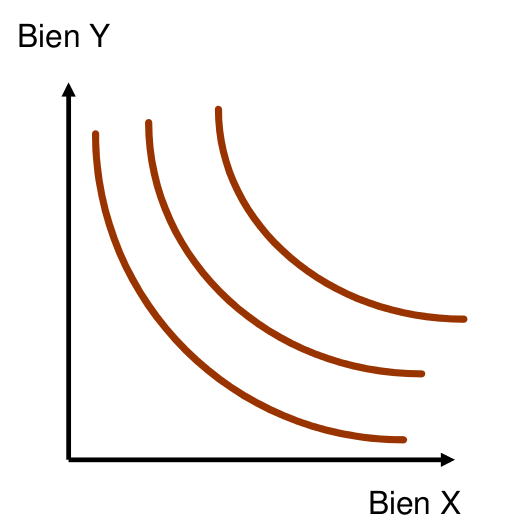

*Dans le cas de biens adictifs (cigarette, drogue etc..) la courbes peut devenir convex.*

#### cas particuliers :

- _Les substituts parfaits_ : ce sont des biens qui sont totalement substituables
les un des autres. On peut consommer des deux de façon indifférente. Les Ci deviennent
des droites dans ce cas.

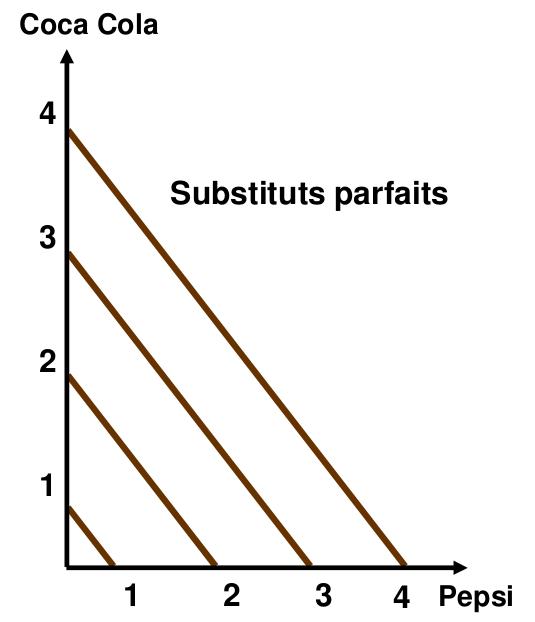

- _Les compléments parfaits_ : ce sont des biens qui doivent obligatoirement être
consomé ensemble. Si l'on achête plus d'un bien que de l'autre reste la même.
les courbes sont parallèles aux axes X et Y.

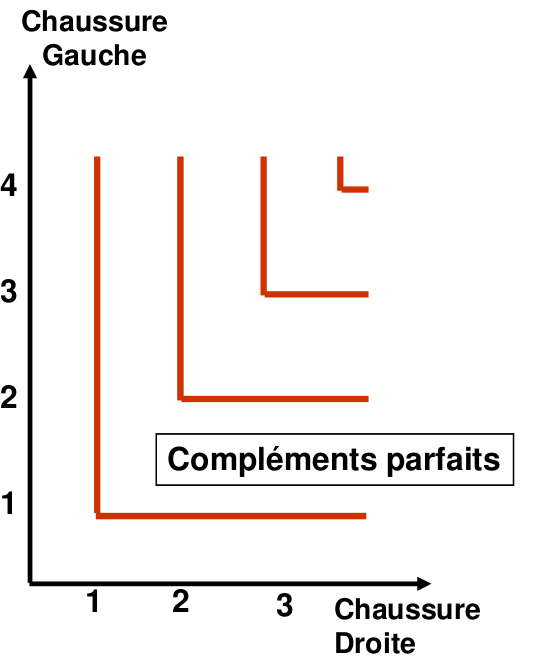

### Gains dans l'échange

Alice à une dotation initiale de (50,10) et Ben de (20,40) ils négocient et se mettent
d'accord sur un échange, Alice donne 20 X en échange de 20 Y. Ils se retrouvent donc
avec un panier de (30,30) pour Alice et (40,20) pour Ben. Ils se retrouvent tout
les deux sur une CI supérieur. ils ont tout les deux gagné à l'échange.

[*économie d'échange dans un camp de prisonier pendant la WW2*](http://icm.clsbe.lisboa.ucp.pt/docentes/url/jcn/ie2/0POWCamp.pdf)

### L'efficacité

* Définition (Pareto): Une situation est efficace s’il est impossible d’augmenter
le bien-être d’un individu sans détériorer celui d’un autre.
Informations pratiques
Voir les slides d'introduction du cour ainsi que le syllabus.

Informations pratiques
Voir les slides d'introduction du cour ainsi que le syllabus.

Informations pratiques
Voir les slides d'introduction du cour ainsi que le syllabus.

* En particulier, s’il existe des échanges mutuellement bénéfiques inexploités,
on n’est pas en situationd’efficacité.

* L’échange libre entre deux personnes amène à une allocation efficace (red paper clip).

* Si ce n’était pas le cas, l’une ou l’autre refuserait d’échanger tout simplement.

* *Hypothèse fondamentale en économie: échange volontaire (personne n’est forcé d’échanger).*

## 2.2 Le choix du consomateur

*Le taux marginal de substitution (TMS)* : est "la pente" d'une CI pour des biens X et Y
si TMSxy = 2 cela signifie qu'on est prêts à "sacrifier" deux Y pour un X.
Dans les conventions le tms est touours en valeur absolue.

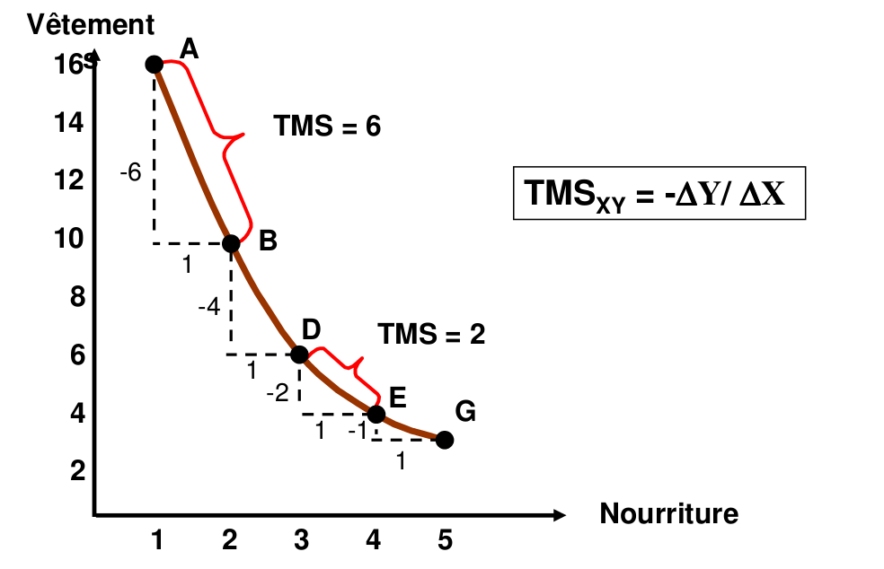
### L'utilité

*L'utilité* : Une fonction d’utilité est un moyen d’assigner un
chiffre à chaque panier de consommation possible, de
manière à ce que les paniers préférés reçoivent une
notation plus élevée que ceux qui leur sont moins
préférés.

Elle représente la satisfaction qu'un individu retire d'une activité.
L'utilité tient compte du contexte, un bien similaire peut apporter une satisfaction
différente suivant le contexte. Elle prends en compte d'autres choses que simplement
de l'argent.

On associe un chiffre à chaque paniers de biens de façon à ce que la notation la
plus élevée soit associées au panier préféré de l'individu.

Si U(x) = 6 et U(y) = 2 alors le panier x est strictement
préféré au panier y. Cependant on ne peut pas dire que x est
préféré 3 fois plus que y. De ce fait on ne **peut pas comparer l'utilité entredeux individus**. L'utilité est un concept ordinal.

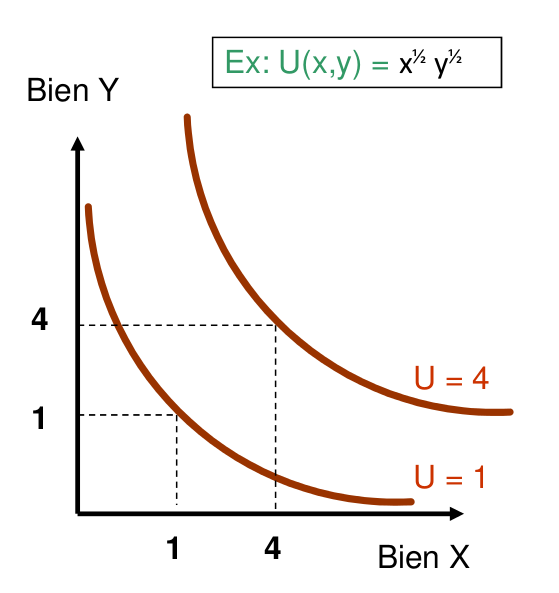

*Utilité marginale du bien X*: utilité supplémentaire obtenue grâce à
la consommation d’une unité supplémentaire de X.

Nous avons également le lien suivant entre l'utilité marginale et le taux marginal
de substitution :
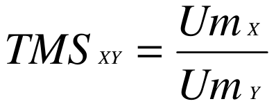

### Droite de budget
C'est une droite qui délimite les biens que l'on peut s'offrire avec
un budget donné. Il ne suffit de connaire la quantité maximale que l'on peut achter
du bien x et du bien y pour la tracer.

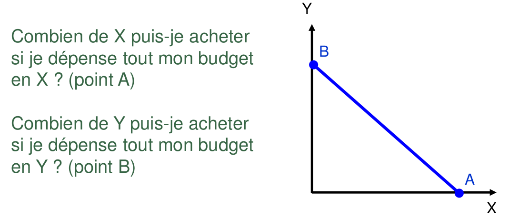

La pente de la droite de budjet dépends uniquement du prix des biens et non
du pouvoir d'achat. On a la relation suivant :

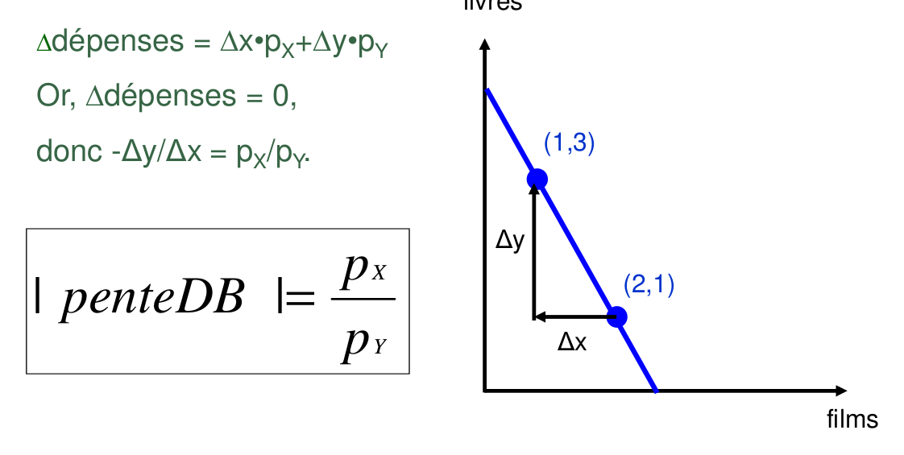

### Le choix optimal

Le choix optimal est le choix du panier de biens qui procure la plus grande satisfaction
possible dans les limites du budget. Dans l'image suivante ça serait donc le choix
du panier *b* qui serait optimal.

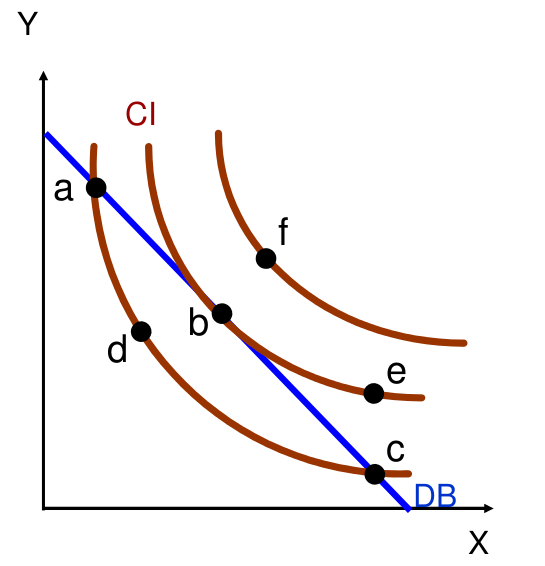

le consomateur dépense tout son budget car dans ce model il a préalablement décidé
ce qu'il allait épargner avant de faire le budget. De ce fait si il n'uttilise
pas tout son budget c'est argent disparait (il le brûle par ex).

Au final nous avons la relation suivante :

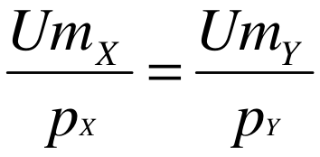

## 3. La demande

Il sagit dans ce chapitre de passer de la notion "d'un seul individu" à toute une population.
La demande est la relation entre le prix d'un bien et la quantité demandé de ce bien.

### La demande individuelle

#### Exemple

Représentez le comportement du consommateur B = 20 CHF, p Y = 2 CHF, p X = 2 CHF, 1 CHF et
0,50 CHF Et (X,Y) = (4,6), (12,4) et (20,5)

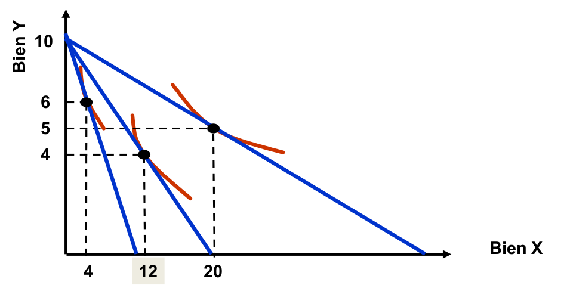

En prenant la quantité consomée de x en fonction de son prix nous pouvons ainsi construire
sa demande individuelle (images de merde à changer...) :

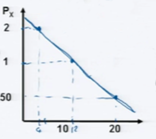

### La demande de marché

La demande de marché c'est la somme de toute les demandes individuelles des individus
qui composent la population. Formellement on a :

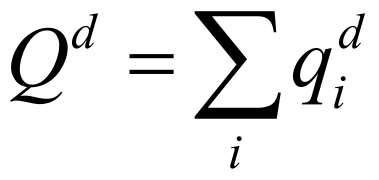

Tracez-la courbe de demande d’une
population consituée de 4 individus
dont la demande individuelle est d.

#### Les facteurs affectant la demande

La quantité demandée Qd dépend généralement de :

* Le prix du bien (si le prix ++ alors Qd --)
* Le prix d'autres biens (Pa) :
  * Si Pa ++ --> Qd ++ alors les biens sont des *substituts*
  * Si Pa ++ --> Qd -- alors les biens sont des *compléments*
* Le revenu des ménages (R) :
  * Si R ++ --> Qd ++ alors c'est un bien *normal*
  * Si R ++ --> Qd -- alors cc'est un bien *inférieur*

##### exemple

On a :
Qd = 1'200 - 9,5 P + 16,2 Pt + 0,2 R
La fonction de demande pour l'huile d'olive en fonction de du prix (P), du prix de
l'huile de tournesole (Pt) et du revenu des ménages (R).

On peut directement voir que :
* Quand P ++ alors Qd --
* L'huile d'olive et l'huile de tournesole sont des biens substituts
* Lhuile d'olive est un bien normal

Le changement du prix d’un bien est accompagné d’un déplacement le long de la courbe de
demande.
Le changement d’un facteur autre que le prix du bien est accompagné d’un déplacement
de la courbe de demande.

### Les élasticités

*Élasticité* : Nombre traduisant la sensibilité d’une variable (Qd) par rapport
à une autre (P).  

#### L'élasticité prix
L’élasticité-prix (Ep) représente le pourcentage de variation de Qd
lorsque P varie de 1%.

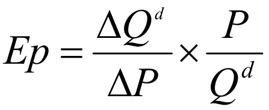  
Or on sait que 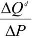 est égale à la pente de la fonction de
demande.  
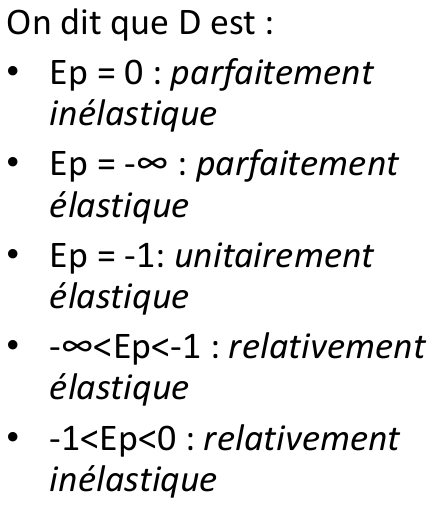

#### Autres types d’élasticité

* *L’élasticité-revenu* donne la variation relative de Q d en réponse à une variation du
  revenu de 1%. 
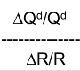

* *L’élasticité-prix croisée* donne la variation relative de Q d d’un bien X
en réponse à une augmentation de 1% du prix d’un autre bien, Y. 
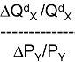

## 4. - 5. Coûts et profits

### La firme

En économie une firme est une entité qui transforme des intrants (matière première
collaborateurs, etc...) en produits finis. 
Le but d'une firme est de maximiser son profits !

Profit (π) = Recettes - Coûts

*Les facteurs de productions (intrants)* :

- Capital (ressources matérielles durables)
- Travail (ressources provenant des employés)
- Matière première (ressource non durable, à tranformer)

*Produit* : biens ou services vendus.

### Les recettes

Rec = P * q

Une augmentation du prix n’entraîne pas toujours d’une augmentation des recettes
car la quantité diminue (offre et demande).

Quand est-il avantageux pour un producteur d’augmenter ses prix?  
Lorsque la demande est inélastique, une hausse du prix entraine une augmentation
des recettes.

### Les coûts

#### La structure des coûts

##### Coûts fixes (CF)
Indépendants de la quantité produite. (ex: achat des batiments,
etc...) Il s’agit des coûts nécessaires afin de servir le premier client. Par exemple :
* Coût d’opportunité
* Coûts de R&D
* Coûts de “production” (ex: CD, film, etc.)
* Coûts de distribution (câble, électricité, eau,...)

##### Coûts variables (CV)
Dépends de la quantité produite (salaires des profs dépends du nombre
d'étudiants)

##### Coût total
CT = CF + CV

##### Coût marginal
L'augmentation du coût total lié à la production d'une
unité suplémentaire.

Le Cm sert à derteminer le prix du vente choisi par une firme.

##### Coût moyen
Coût de produire une unité (en moyenne) quand la firme produit
un total de Q unités. 
CM = CT/Q  
Il sert à déterminer la rentabilité de la firme. il prends généralement la forme suivante :

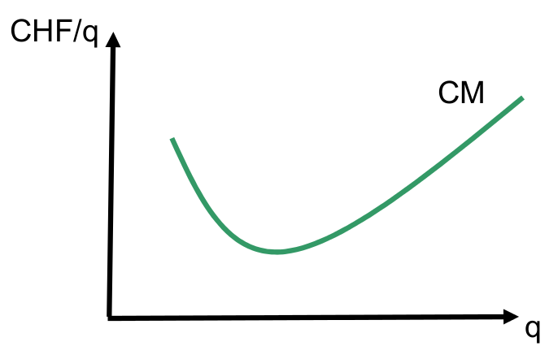

1. économies d'echelle, CM -- quand Q ++
2. deséconomies d'echelle, CM ++ quand Q ++

Sources d’économies d’échelle:
* Spécialisation
* Large quantité d’intrants nécessaire au fonctionnement
* Lorsqu’une fusion permet d’éliminer la duplication des coûts d’implantation.

Sources de déséconomies d’échelle:
* Gestion difficile si taille trop importante.
* Problèmes de communication interne.

##### Coût variable moyen
CV de production d'une unité en moyenne quand la firme
produit Q unités.
CVM = CV/Q
Sert à determiner si la firme doit fermer.

- Cm < CM => CM --
- Cm > CM => CM ++

##### Synthèse

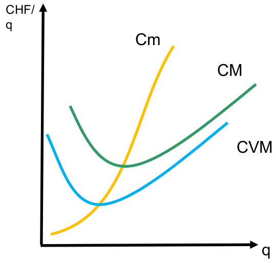

Si Cm > CM, alors CM augmente car le coût nécessaire pour produire une unité suplémentaire
est supérieur au coût moyen de la production de toutes les unités précédentes.

Si Cm < CM, alors CM diminue car le coût nécessaire pour produire une unité suplémentaire
est inférieur au coût moyen de la production de toutes les unités précédentes.

CM = Cm au point où CM atteint son minimum (parce que c'est logique et voila !)

#### Le coût d'opportunité

[Coût d'opportunité au chap 1](#coût-dopportunité)

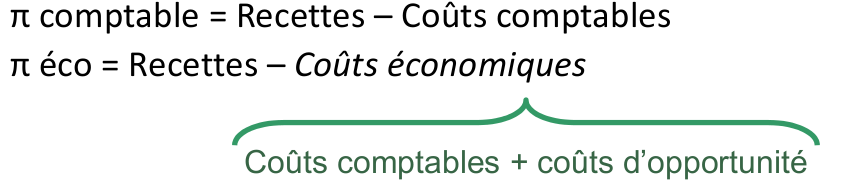

Contrairement au profit comptable, qui consiste surtout à
faire un bilan des réalisations passées, le profit
économique concerne les décisions actuelles et leurs
conséquences futures.

#### Les Coûts irrécupérables

Les coûts irrécupérables concernent des décisions irréversibles qui ont déjà été prises.
Les coûts irrécupérables ne sont pas pertinents dans la prise de décisions.

On peut illustrer la notion de coûts irrécupérables avec l'exeple suivant :

* Vous avez fait faire 1000 t-shirts humoristiques, à un coût unitaire de 15 CHF.
* Malheureusement, ils sont très mal reçus du public, et personne ne veut les acheter à ce
prix-là (15 CHF).
* Acceptez-vous de baisser votre prix de vente en-deçà de 15 CHF?

Les 15 000 CHF d'ivestissement sont un coût irrécupérable.

### Distinction Court terme/Long terme

La notion de court terme et long terme peut varier en fonction du type d'industrie
concerné.

**exemple** : Un nouveau restaurant s’aperçoit que son succèsdépasse ses attentes.
Quelles sont ses options... :
* ...à court terme (dans les semaines qui suivent) ?
  * Ettendre les heures d'ouvertures
  * Optimiser l'utilisation du capital fix (mieux uttiliser l'espace du restaurant etc...)
  * **Cela renviens a augmenter l'utilisation des facteurs variables**
* ...à long terme (dans les années à venir) ?
  * Engager du personel suplémentair
  * Augmenter la taille du restaurant
  * **Cela renviens a augmenter l'utilisation des facteurs qui sont fixes à court terme**

À long terme, l’utilisation des intrants n’est pas contrainte (ex.: taille d’une usine,
contrats avec les fournisseurs, etc.). Il se passe suffisamment de temps pour que tous les
intrants soient variables.

Même s’il se passe suffisamment de temps pour que tous les intrants soient variables
il peut exister des coûts fixes à long terme. (ex. R&D, loyer, coût d’opportunité, etc.)

À court terme, certains intrants sont fixes (car trop peu de temps pour s’ajuster)  
Donc, moins de flexibilité --> les coûts de CT sont supérieurs aux coûts de LT.

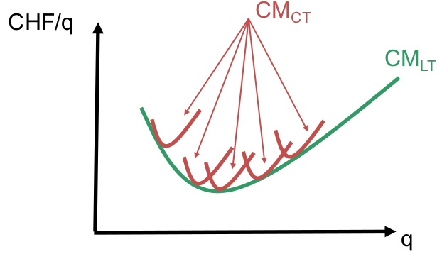

### La maximisation du profit

On a une fonction de profit sous la forme  
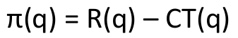  
On cherche la quantité q*, qui permet de maximiser le profit.

On a la recette marginale qui est 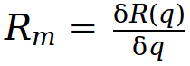  
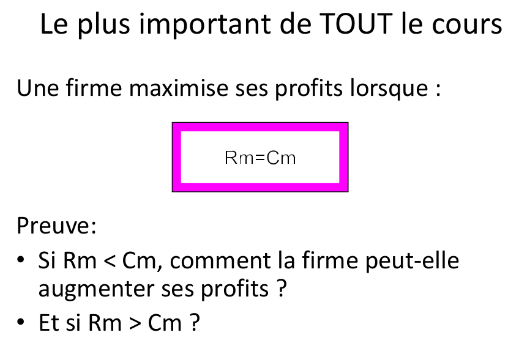

## 6. Firmes et marchés concurrentiels

## 7. Equilibre de marché

l'équilibre de marché est le point ou l'offre et la demande son égale l'une à
l'autre. On note P* le prix a l'équilibre et Q* la quantité.

P*: Qo=Qd (slide 4)

### Forces de marché

Même si chaques consomateurs et chaques producteurs agissent et font des
décisions totalements indépendantes et décentralisée on s'accorde quand même
sur le même prix d'équilibre.

si P < P* on a un excès de demande, le prix aura tendance à augmenter.

si P > P* on a un excès d'offre, le prix aura tendance à baisser.

certains marchés ou l'offre et la demande varient grandement et de ce fait les
sont volatiles. Cela ne signifie pas qu'ils n'ont pas d'équilibre.

### Déplacement de l’équilibre

Dans le cas du slide 8 la demande diminue pour ce type de maïs particulier.
le résultat sur ce marchés le prix d'équilibre va diminuer et donc les quantités
avec.

Dans le cas du slide 9 le fait que le prix de l'engrais augmente alors le coût
marginal augmenet, cela implique que la courbe de l'offre monte. De ce fait le
prix va augmenter et les quantités échangées diminuer.

*Réglementation de prix (slide 10)*

Si on limite le loyer à 80CHF/m^2 alors que le prix de marché se situe à 100CHF
on se retrouve avec un excès de demande. Il y a donc une pénurie d'appartement.
Certaines personnes qui auraient eu accès à un appartement au prix du marchés
n'en auront pas dans ce cas. pour dimminuer le loyer il vaut mieux augmenter l'offre.

### Mesure de bien-être

On ne peut pas utiliser la notion d'utilité pour mesurer le bien-être de la population.

#### Surplus du consommateur (SC)

Différence entre le prix qu'on est prêt à payer pour un bien et le prix que l'on
paie effectivement.
Si on est prêt à payer 200.- pour un cannapé et on le trouve a 150.- sur ebay
alors le surplus du consomateur est de 50.-.

Le SC est toute la zone sous la demande et au dessus du prix (slide 14).

Les demandes les plus inélastiques au prix (plus verticales) souffririont plus
de l'augmentations du prix (slide 16).

## 8.Monopole et pouvoir de marché

Qu’elles sont les origines d’un monopole ?

- Origines légales; e.g. Services postaux.
- Brevets; e.g. Médicaments.
- Seule détenteur d’une ressource; e.g. autoroute.
- Larges économies d’échelles (services des eaux, réseau de train...)

*CPP* : concurence pur et parfaite

### Recettes marginales

Rm toujours en dessous de D

si D: p = 24 - Qd

R = 24Q - Q^2

Rm = R' = 24 - 2Q

[...]

on peut montrer que Rm = p(1+1/Ep)

### Pouvoir de Marché (PdM)

Définition: La capacité à vendre à un prix supérieur au coûtmarginal sans perdre
tous ses clients.

Si CPP : P=Cm si Pdm: P>Cm

Indice de Lerner: L = (p-Cm)/p = -1/Ep

_CPP_ : Ep --> - infini ==> L --> 0

*Monopole* : Ep --> -1 ==> l -->  1

sources d’inelasticité de demande :

- Absence de produits substituts : médicaments avant que le brevet soit échu, etc...
- Barrières à l’entrée : ...
- Coûts de transactions : couts fixe très grands au début (nucléaire)
- Lois : limitations du nombre de supermaché sur une zone donée (merde in france)

### Le coût social du monopole
Les consommateurs sont discriminés selon une caractéristique non observable : leurs préférences. Par exemple: Menu de prix, tarification par blocs
Les consommateurs sont discriminés selon une caractéristique non observable : leurs préférences. Par exemple: Menu de prix, tarification par blocs

|  /      | CPP        |  Monop   |delta  |
|----     |--------    |--------  |---    |
| SC      | A+B+C      |  A       |  -B-C |
| SP      | E+F+G      |  G+E+B   |  -F+B |
| ST=SC+SP| A+B+C+E+F+G|  A+B+E+G |  -C-F |

La firme « Starbucks » a-t-elle du pouvoir de marché ? oui , P > Cm

La firme « Starbucks » est-elle la seule sur le marché des cafés ? Non

Comment expliquez-vous cette « contradiction » ? Les biens proposés sont différents
de ceux des cocurents. ==> pouvoir de marché. --> mais pas de barières à l'entrée.
--> imitation. ==> sur le long terme.

On appelle cela la **concurence monopolistique**.

## 9. Stratégies de prix

*Discrimination par les prix (DP)*:
Faire payer des prix différents pour des produits identiques.
Les rabais étudiants oLes consommateurs sont discriminés selon une caractéristique non observable : leurs préférences. Par exemple: Menu de prix, tarification par blocs
nt pour but de maximiser les profits et non de subventioner les
étudiants.

3 conditions necessaires pour pratiquer la DP :

- la capacité à choisir son prix ==> avoir du pouvoir de marché
- l'information sur les clients ==> infos sur les demandes
- la possibilité de revente ==> la revente doit être difficile

### Discrimination parfaite (premier degré)

Charger à chaque consommateur son prix de reserve (prix maximum prêt à payer).

(Voir slide 6(ajouter graph)) Le premier client payera 4.- le deuxième 3.- et le troisième
2.-.
le profit sera : 4+3+2 - 3*1.5 = 4.5

==> la firme fait les profits les plus importants possibles.

Une vente aux enchère est une forme de discrimination parfaite.

### Discrimination implicite (deuxième degré)

Les consommateurs sont discriminés selon une caractéristique non observable : leurs
préférences. Par exemple: Menu de prix, tarification par blocs
[...]

### Discrimination explicite (troisième degré)

Les consommateurs peuvent-être classés selon une caractéristique observable. C'est
le type de discrimination qui est le plus observé en pratique.

## 10. Interactions stratégiques

*Equilibre de Nash (EN)*: Un EN est une situation où chaque joueur joue
une stratégie de meilleure réponse face à la
stratégie de l’autre ; c-à-d., où personne n’a intérêt
à dévier unilatéralement.

## 11. Bien Public et externalités

Les pricipales différences d'un bien public par rapport à un bien privé sont :
- Non-exclusion : impossibilité d'exclure des consomateurs.
- Non-rivalité : la consomation d'un agent n'impacte pas la consomation des autres
agents.

Exemples de biens publiques : air pure, éclairage publique, etc ...

### Non-rivalité

Une fois produit, le coût additionnel pour qu’une autre personne consomme une unité
du bien est nul.

Par exemple : un phare. Une fois qu’il est construit etqu’il est allumé, le coût
pour qu’il éclaire un bateau additionnel est nul.

Certain biens non-rivaux perdent cette caractéristiques’il y a trop de consommateurs:
phénomène de congestion (i.e. autoroute, piscine, internet...).

### Non-Exclusion

Quand il est difficile, voire impossible d’exclure quelqu’un de consommer un bien.

Exemple:
- air pur, paysage
- éclairage de rue
- défensenationale
- qualité de l’environnement
- etc ...

La non-exclusion est directement associée au problèmedu «comportement de resquilleur»
(«free rider problem» en anglais).

|  | Rivalité | Non-rivalité|
|--|----------|-------------|
| **Exclusion**| Biens privés pures | Biens mixtes|
| **Non-exclusion** | Biens mixtes| Biens publics pures|

### Comportement de Resquilleur

La non-exclusion est la cause de l’impossibilité defournir efficacement un bien public par
le marché. La difficulté d’exclusion permet de consommer le biensans avoir à en payer le
prix et donc couvrir le coût.

Par exemple: il est impossible (sans intervention collective) de faire payer chaque personne
qui bénéficie d’un éclairage public, ou qui bénéficie d’un environnement plus sain.

Exemple cop21 :
- Deux gros pays se font face lors de négociations sur le climat.
- Chaque pays gagne si l’autre fait des efforts (car moins de CO2 dans l’atmosphère) mais
- faire des efforts est couteux (en terme politique).
- Si les deux pays font des efforts alors le gain commun est maximum. Mais chaque pays a
- intérêt à profiter des efforts des autres. Résultats des négociations ?

Voir la matrice de gain au slide 10. Equillibre de Nash pour le cas ou aucun des pays ne
fait d'efforts.

[...]

### Les Externalités

Une externalité se définit comme l’impact sans contrepartie de l’action d’un individu
sur le bien-être d’un autre individu.

- Si l’impact sur le tiers est défavorable, il s’agit d’une externalité négative.
- Si l’impact sur le tiers est avantageux, il s’agit d’une externalité positive.

Externalités négatives :
- La pollution
- Les gaz d’échappement d’une voiture
- Les personnes qui discutent en cours

Externalités positives :
- L’éducation ou le savoir en général
- Les vaccins
- La restauration d’un ouvrage d’art
- La création d’un parc naturel

La présence d’externalités négatives conduit les marchés à produire une quantité
supérieure à la quantité socialement optimale. Inversement pour les externalités positives.
**Voir slide 19**
